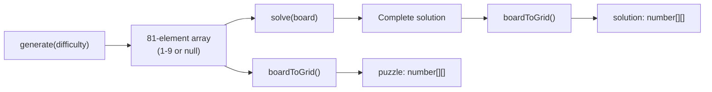
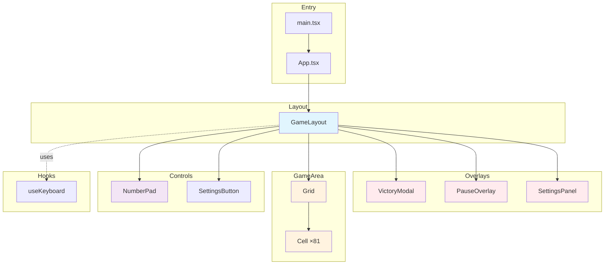
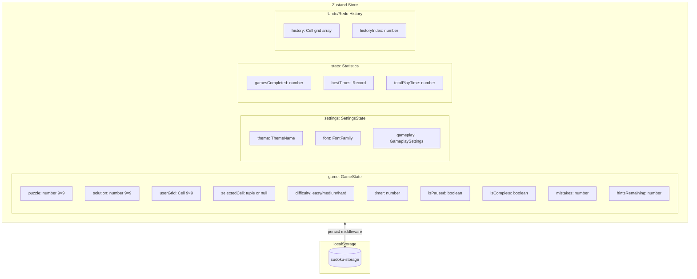
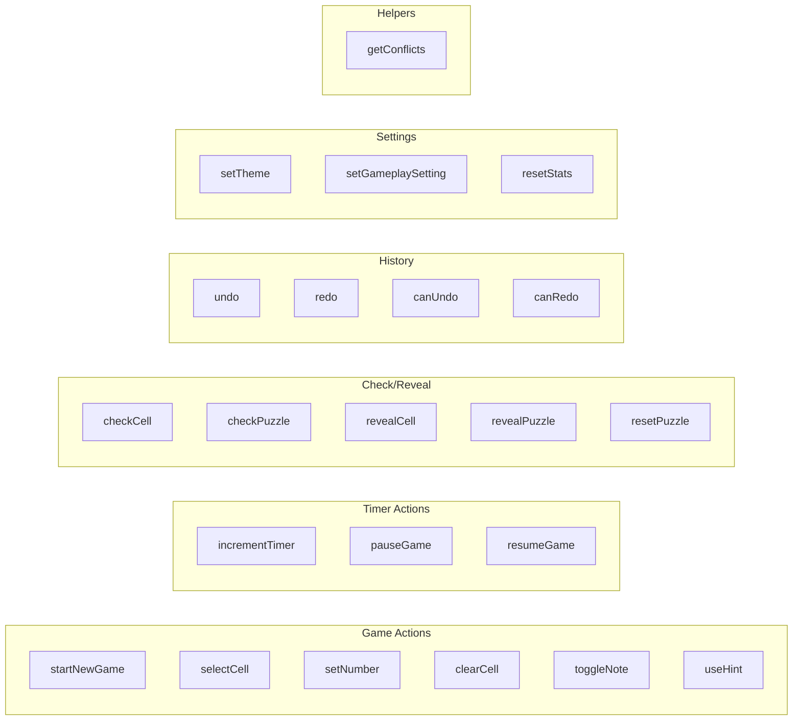
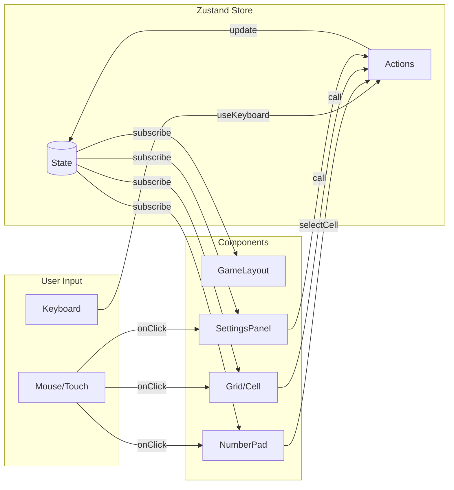
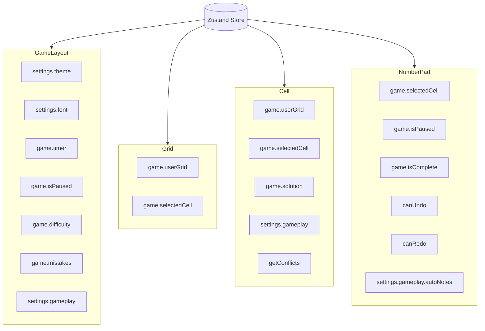
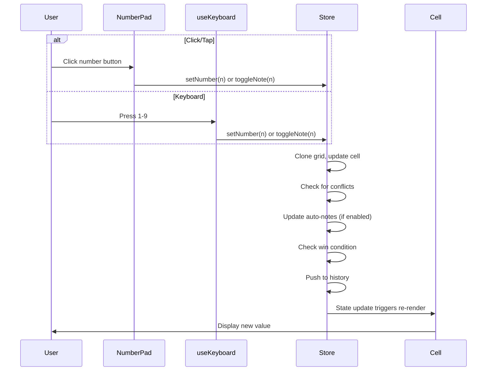
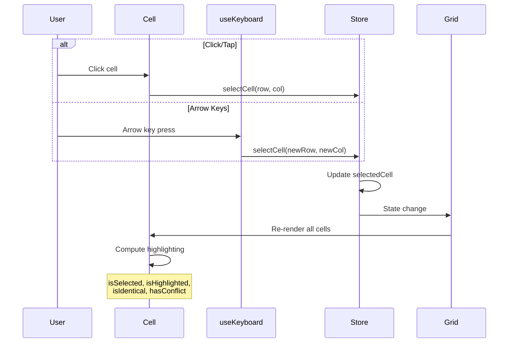
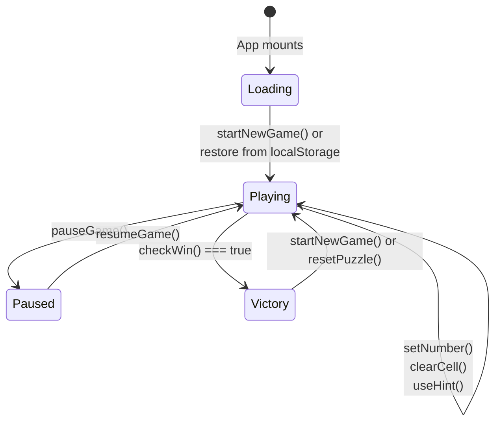
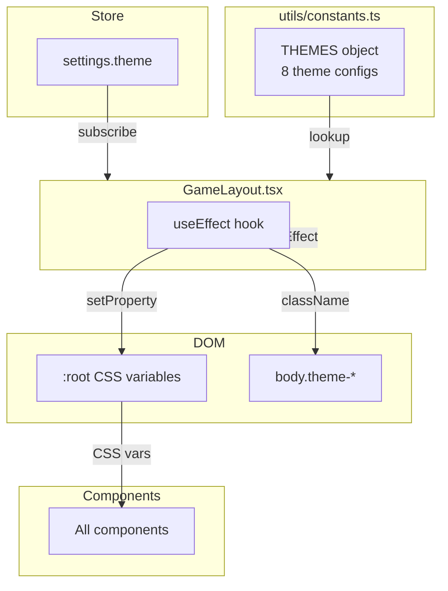

# Sudoku Terminal — Architecture Documentation
 
> **Last Updated**: December 2025 

## Table of Contents

- [Overview](#overview)
- [Tech Stack](#tech-stack)
- [Project Structure](#project-structure)
- [Component Hierarchy](#component-hierarchy)
- [State Management](#state-management)
- [Data Flow](#data-flow)
- [User Interaction Flow](#user-interaction-flow)
- [Theming System](#theming-system)
- [Key Patterns](#key-patterns)

---

## Overview

Sudoku Terminal is a React-based Sudoku game with a terminal/retro aesthetic. The application uses a unidirectional data flow pattern with Zustand for state management and CSS Modules for scoped styling.

### Core Principles

- **Single source of truth**: All game state lives in one Zustand store
- **Unidirectional data flow**: Store → Components → User Actions → Store
- **Persistence**: Game progress and settings auto-save to localStorage
- **Responsive**: Separate layouts for mobile and desktop

---

## Tech Stack

| Layer | Technology | Purpose |
|-------|------------|---------|
| **UI** | React 19 | Component framework |
| **Language** | TypeScript | Type safety |
| **Build** | Vite | Fast dev server and bundling |
| **State** | Zustand | Lightweight state management |
| **Icons** | Lucide React | Icon library |
| **Styling** | CSS Modules | Scoped component styles |
| **Puzzle Gen** | `sudoku-core` | Logic-based puzzle generation (no guessing) |

---

## Puzzle Generation

Puzzles are generated using [sudoku-core](https://github.com/komeilmehranfar/sudoku-core), which guarantees all puzzles are solvable using logic techniques (no guessing/backtracking required).

### Difficulty Levels

Difficulty is determined by which solving strategies are required:

| Level | Strategies Required | Hints Allowed |
|-------|---------------------|---------------|
| Easy | Single Remaining Cell, Single Candidate Cell | 5 |
| Medium | + Single Candidate Value, basic elimination | 3 |
| Hard | + Pointing Elimination, advanced techniques | 0 |

The package uses a scoring system based on strategy frequency and complexity. Higher difficulties require more advanced techniques applied more often.

### Generation Flow



---

## Project Structure

```
src/
├── components/
│   ├── Controls/
│   │   ├── NumberPad.tsx          # Number input, notes toggle, undo/redo
│   │   └── NumberPad.module.css
│   ├── Grid/
│   │   ├── Grid.tsx               # 9×9 grid container with responsive sizing
│   │   ├── Grid.module.css
│   │   ├── Cell.tsx               # Individual cell with highlighting logic
│   │   └── Cell.module.css
│   ├── Layout/
│   │   ├── GameLayout.tsx         # Main orchestrator component
│   │   └── GameLayout.module.css
│   └── UI/
│       ├── VictoryModal.tsx       # Win screen overlay
│       ├── PauseOverlay.tsx       # Pause screen overlay
│       ├── SettingsPanel.tsx      # Slide-out settings/menu panel
│       ├── SettingsButton.tsx     # Hamburger menu trigger
│       └── *.module.css
├── hooks/
│   └── useKeyboard.ts             # Global keyboard event handler
├── store/
│   └── index.ts                   # Zustand store (single file)
├── styles/
│   ├── global.css                 # CSS reset, variables, base styles
│   └── themes.css                 # Theme-specific overrides
├── types/
│   └── index.ts                   # TypeScript interfaces
├── utils/
│   ├── constants.ts               # Theme configs, difficulty settings
│   └── sudoku.ts                  # Puzzle generation/validation
├── App.tsx                        # Root component
├── main.tsx                       # React entry point
└── index.css                      # CSS imports
```

---

## Component Hierarchy



### Component Responsibilities

| Component | Responsibility |
|-----------|---------------|
| **GameLayout** | Orchestrates everything: theme application, timer interval, layout switching (mobile/desktop), composes all child components |
| **Grid** | Renders 9×9 grid, handles responsive sizing via ResizeObserver |
| **Cell** | Renders single cell, computes highlighting states, displays value or notes |
| **NumberPad** | Number buttons (1-9), notes toggle, erase, undo/redo, reset |
| **SettingsPanel** | Full menu: new game, difficulty, gameplay options, themes, stats, hints, check/reveal |
| **VictoryModal** | Displays on win: time, mistakes, replay/new game options |
| **PauseOverlay** | Displays when paused: hides grid, shows resume button |
| **SettingsButton** | Hamburger menu icon to open SettingsPanel |

---

## State Management

### Store Structure

The application uses a single Zustand store with the `persist` middleware for localStorage persistence.



### Type Definitions

```typescript
interface Cell {
  value: number;              // 0 = empty, 1-9 = filled
  isGiven: boolean;           // true if part of original puzzle
  manualNotes: number[];      // manual pencil marks (passive layer)
  autoNotes: number[];        // auto-calculated candidates (reactive layer)
  userEditedInAuto: number[]; // tracks manual edits in auto mode
}

type Difficulty = 'easy' | 'medium' | 'hard';
type ThemeName = 'light' | 'dark' | 'green' | 'amber' | 'paper' | 'monochrome' | 'ocean' | 'clean';

interface GameplaySettings {
  autoCheckMistakes: boolean;   // Highlight wrong numbers
  highlightConflicts: boolean;  // Show conflicting cells
  highlightRowColumn: boolean;  // Highlight selected row/column
  highlightBox: boolean;        // Highlight 3×3 box
  highlightIdentical: boolean;  // Highlight same numbers
  showTimer: boolean;           // Display timer
  showMistakes: boolean;        // Display mistake counter
  autoNotes: boolean;           // Auto-calculate pencil marks
}
```

### Dual-Layer Notes System

The game maintains two independent candidate layers:
- **Manual notes** (`manualNotes`): Passive scratchpad with no algorithmic intervention
- **Auto notes** (`autoNotes`): Reactive layer that auto-prunes when pen values are placed

User edits made in auto mode are tracked in `userEditedInAuto` and protected from auto-pruning.

### Store Actions



---

## Data Flow

### Unidirectional Flow Pattern



### Component → Store Subscriptions

Each component subscribes to specific slices of state using Zustand's selector pattern:



---

## User Interaction Flow

### Number Entry Flow



### Cell Selection Flow



### Game Lifecycle



---

## Theming System

### Theme Architecture

Themes are applied via CSS custom properties, set dynamically by GameLayout.



### CSS Variable Flow

```typescript
// GameLayout.tsx applies theme on change
useEffect(() => {
  const themeConfig = THEMES[theme];
  const root = document.documentElement;
  
  root.style.setProperty('--color-primary', themeConfig.primary);
  root.style.setProperty('--color-background', themeConfig.background);
  root.style.setProperty('--color-surface', themeConfig.surface);
  // ... more variables
  
  document.body.className = `theme-${theme}`;
}, [theme]);
```

### Available Themes

| Theme | Description |
|-------|-------------|
| `light` | Clean light theme |
| `dark` | Dark mode |
| `clean` | Minimal blue accent |
| `paper` | Sepia/newspaper style |
| `green` | Terminal green phosphor |
| `amber` | Retro amber CRT |
| `ocean` | Deep blue tones |
| `monochrome` | Pure black and white |

---

## Key Patterns

### 1. Selective Zustand Subscriptions

Components subscribe only to the state they need, preventing unnecessary re-renders:

```typescript
// Good: Selective subscription
const timer = useStore((state) => state.game.timer);

// Avoid: Subscribing to entire store
const store = useStore();  // Re-renders on ANY change
```

### 2. Grid State Cloning

All grid mutations create new arrays to ensure React detects changes:

```typescript
const cloneGrid = (grid: Cell[][]): Cell[][] => {
  return grid.map(row => row.map(cell => ({
    ...cell,
    manualNotes: [...cell.manualNotes],
    autoNotes: [...cell.autoNotes],
    userEditedInAuto: [...cell.userEditedInAuto],
  })));
};
```

### 3. History Management

Undo/redo is implemented by storing grid snapshots:

```typescript
// On each change:
const newHistory = state.history.slice(0, state.historyIndex + 1);
newHistory.push(cloneGrid(newGrid));
// historyIndex points to current state
```

### 4. Conditional Rendering for Overlays

Modals render `null` when inactive to avoid DOM overhead:

```typescript
const VictoryModal = () => {
  const isComplete = useStore((state) => state.game.isComplete);
  if (!isComplete) return null;  // Not in DOM
  return <div className={styles.overlay}>...</div>;
};
```

### 5. Responsive Layout Strategy

GameLayout renders both mobile and desktop layouts, controlled by CSS:

```tsx
<main className={styles.main}>
  <div className={styles.mobileLayout}>  {/* display: none on desktop */}
    ...
  </div>
  <div className={styles.desktopLayout}> {/* display: none on mobile */}
    ...
  </div>
</main>
```

---

## Storage Schema

The store persists to localStorage under key `sudoku-storage`:

```typescript
{
  _version: 3,  // Schema version for migrations
  game: { /* GameState */ },
  settings: { /* SettingsState */ },
  stats: { /* Statistics */ },
  history: [ /* Cell[][][] */ ],
  historyIndex: number
}
```

Breaking changes to state structure require incrementing `STORAGE_VERSION` and implementing migration logic.

---

## Future Considerations

Areas that could be extended:

- **Audio/SFX**: Sound effects for moves, wins, errors
- **Animations**: Framer Motion for cell transitions, victory effects
- **Multiplayer**: Would require WebSocket integration
- **Daily puzzles**: Would require server-side puzzle generation
- **Statistics expansion**: Track streaks, average times, completion rates

---

## Viewing This Document

This document uses [Mermaid](https://mermaid.js.org/) for diagrams.

- **GitHub**: Diagrams render automatically
- **VS Code**: Install the "Markdown Preview Mermaid Support" extension
- **Local preview**: Use [mermaid.live](https://mermaid.live) to test individual diagrams

---
