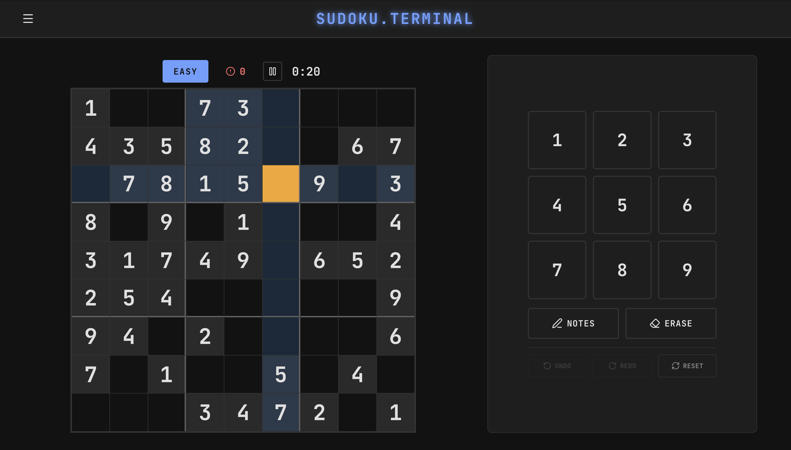

# Sudoku Terminal

A terminal-themed Sudoku game built with React, TypeScript, and Vite.

**[Play Live](https://sudoku.kahdev.me/)** · **[API Docs](https://sudoku.kahdev.me/docs/)**



## Features

- **Three difficulty levels** with unique, solvable puzzles
- **Eight themes**: Light, Dark, Clean, Paper, Green Phosphor, Amber CRT, Ocean, Monochrome
- **Auto notes**: Automatically track possible numbers per cell
- **Pencil mode**: Manual corner notes when auto notes is off
- **Undo/Redo**: Full move history with keyboard shortcuts
- **Timer** with pause/resume
- **Mistake tracking** with optional auto-check highlighting
- **Hint, Check and Reveal**
- **Keyboard navigation**: Arrow keys, number keys, shortcuts
- **Responsive design**: Desktop and mobile layouts
- **Auto-save**: Progress persists to localStorage

## Controls

| Action | Desktop | Mobile |
|--------|---------|--------|
| Select cell | Click / Arrow keys | Tap |
| Enter number | 1-9 keys | Number pad |
| Clear cell | Backspace / Delete / 0 | Erase button |
| Toggle notes | N or P | Notes button |
| Undo | Ctrl+Z | Undo button |
| Redo | Ctrl+Shift+Z | Redo button |
| Pause | Click timer | Click timer |

## Installation
```bash
git clone https://github.com/khesse-757/sudoku-game.git
cd sudoku-game
npm install
```

## Development
```bash
npm run dev
```

Opens at `http://localhost:5173`

To test on mobile, access `http://[YOUR_LOCAL_IP]:5173` from your phone on the same network.

## Build & Deploy

Build manually:
```bash
npm run build
```

Deployment is automated via GitHub Actions. Pushing to `main` triggers a build and deploy to GitHub Pages. See [.github/workflows/](.github/workflows/) for configuration.

Bump VERSION:
```bash
./bump-version.sh
```

## Project Structure
```
src/
├── components/
│   ├── Controls/       # NumberPad (number input, notes, undo/redo)
│   ├── Grid/           # Sudoku grid and cell rendering
│   ├── Layout/         # Main game layout orchestrator
│   └── UI/             # Settings panel, Victory modal, Pause overlay
├── hooks/
│   └── useKeyboard.ts  # Keyboard input handling
├── store/
│   └── index.ts        # Zustand state management
├── styles/
│   ├── global.css      # Base styles and CSS variables
│   └── themes.css      # Theme-specific overrides
├── types/
│   └── index.ts        # TypeScript interfaces
├── utils/
│   ├── constants.ts    # Theme configs, difficulty settings
│   └── sudoku.ts       # Puzzle generation and validation
├── App.tsx             # Root component
├── main.tsx            # Entry point
└── index.css           # CSS reset
```

## Tech Stack

- **React 19** + **TypeScript**
- **Vite** - Build tool
- **Zustand** - State management with localStorage persistence
- **Lucide React** - Icons
- **CSS Modules** - Scoped styling

## Documentation

- **[Architecture](ARCHITECTURE.md)** - Component hierarchy, data flow, state management
- **[API Docs](https://sudoku.kahdev.me/docs/)** - TypeDoc-generated API reference

## License

MIT